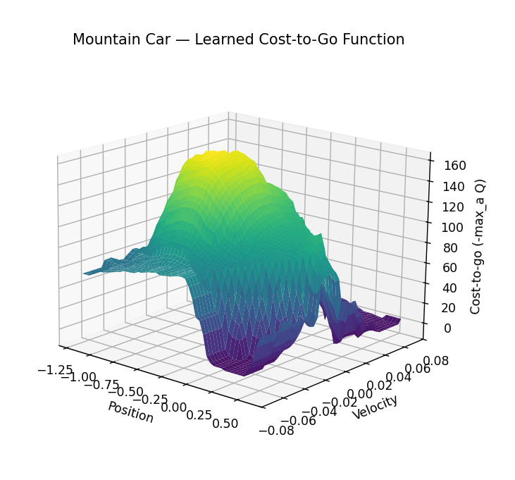
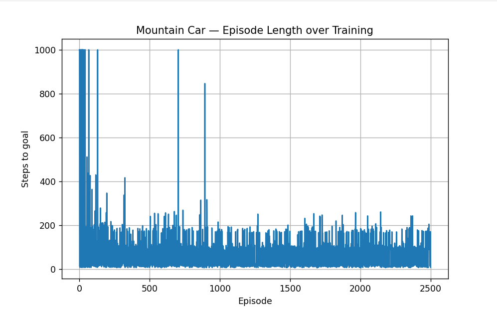

## Important note

The skeleton of this code was generated using AI along with the expected inputs and outputs
as comments since I am not all that confident with OOPS in python yet. And the plotting part
was done by AI as well. This was just a learning project to understand the concepts I had learnt
from the book.

# Mountain Car — Semi-Gradient SARSA with Tile Coding

This is an implementation of the Mountain Car problem from the Sutton and Barto
book. The way it is solved in this implementation is by using tile coding and semi-gradient
SARSA. This is because tabular learning doesn't work here like it does in Gridworld
since the state space is continuous (can't store all possible states in a table) but it's
still small enough to solve without a neural net.

## The problem

A car doesn't have enough power to get out of the two hills it sits between.
The task is to make the agent learn to reverse up the hill behind to gain enough
momentum to get on top of the other hill.

State: `(position, velocity)`, both continuous.
Actions: `reverse`, `none`, `forward`.
Reward: `-1` per step until the goal is reached (to punish long episode lengths)

## What tile coding does

Since the state space is only 2D, it is simple to divide the space into a grid
and therefore discretize the state space, where each tile of the grid also
has tilings which are just the base tiles offset diagonally toward the other states
so that there is some sort of continuity between states in adjacent tiles instead of
a sudden change.

Each tile has a spot in the feature vector and is fired when a state is inside that tile.
Therefore each state has a subset of tiles it causes to fire, and each of those tiles are also
part of the weight vector, and therefore helps us update the weights in accordance to the rewards
we get according to the policy.

**Implementation specifics:**
- 8 tilings, 8×8 tiles per tiling
- Each tiling is offset from the others using strides of 3 (position) and
  5 (velocity) — both coprime with the number of tilings (8), so no two
  tilings end up with the same offset
- Total feature vector length: `num_tilings * tiles_per_dim^2 * num_actions`,
  and since features are binary, `Q(s,a)` is just a sum over the active
  tile weights rather than a full dot product

## What makes this "semi-gradient" SARSA

The update rule used to nudge the weight towards optimality ignores the fact that the target itself
is a function of the weight, so the gradient is just the feature vector and this also keeps the
computation simple.

## Files

- `mountain_car.py` — environment, tile coder, linear Q-function,
  epsilon-greedy policy, and the SARSA training loop

## Running it

```bash
python mountain_car.py
```

Trains for 2500 episodes with epsilon decaying by 0.99 per episode, then
plots the episode-length learning curve and the learned cost-to-go surface
over `(position, velocity)`.

## Results




This closely resembles the results produed in the book